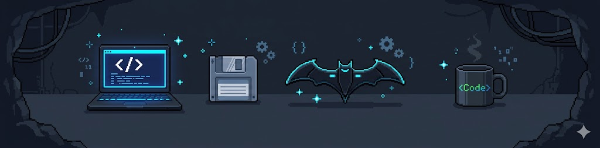

# DevHatBat

Minimalist interfaces inspired by the night.

---

## 🦇 About Me

Frontend Developer focused on secure and modern interfaces.

### ⚡ Stack

- React / Next.js
- TailwindCSS
- TypeScript
- Node.js / Express
- PostgreSQL / Supabase

### 🌌 Current Focus

- Secure frontend systems
- Threat modeling
- UI performance
- Minimalist interfaces

---

## ⚙️ Tech Stack

---

## 🌙 Philosophy

> “Clean UI. Secure systems. Silent execution.”
